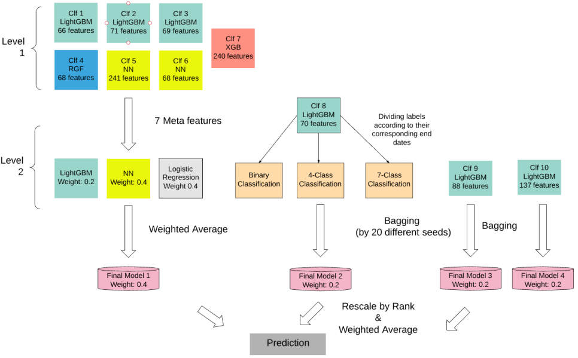
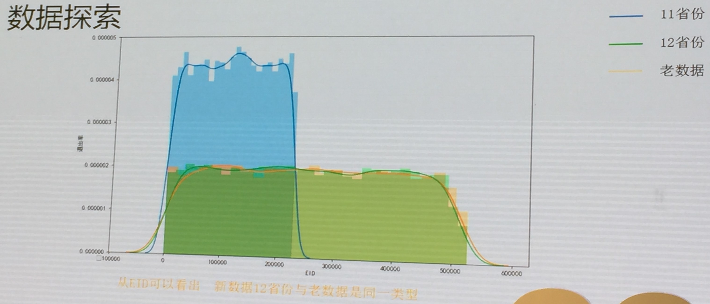
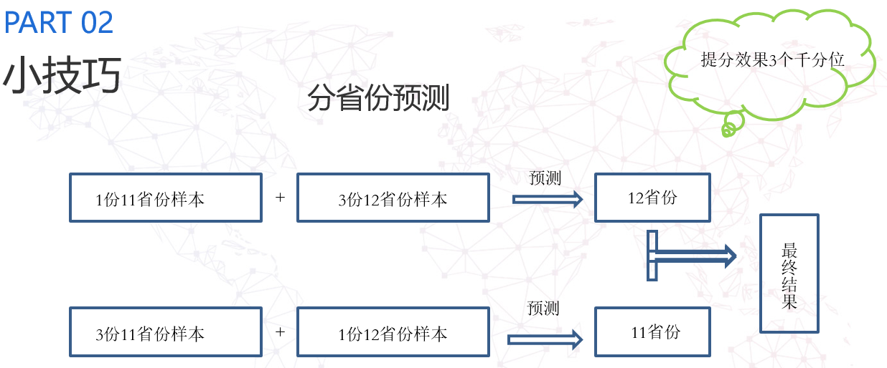

## Top 5 最后的战役 

最后的战役队伍中有多名互联网金融的从业人员，所以他们对业务的理解较为深入。

### 特征工程

1. 企业所在行业竞争的激烈程度 （entbase衍生特征 ）

   - 同行业类型的公司数 
   - 同企业类型的公司数 
   - 同行业同企业类型的公司数 

2. 企业在该行业内的水平 （entbase衍生特征 ）

   - 同行业类型按照注册资本排序 
   - 同企业类型按照注册资本排序 
   - 同成立年度按照注册资本排序 
   - 限定行业类型、 企业类型、 成立年度再按照注册资本排序 

3. 跨表特征

   - alter表到qualification表相应行为的最早、 最晚时间与企业注册年限的时间跨度。 如企业最早
     （最晚）修改年限与企业注册年限的时间跨度。 提升近7个万分点。 

4. 组合特征

   - 积极特征： 一个公司分公司数量、 投资的公司数量、 获得的权利等和公司的经营状况大致成正相关 
   - 消极特征： 而失信次数、 被执行案件次数等特征则大致和一个公司的经营状况呈现负相关 

   将积极特征和消极特征分别进行了组合，采用两两相乘再取对数的组合方法，获得19维的组合特征 

5. 构造GBDT衍生特征，具体方法可见[Blog](http://breezedeus.github.io/2014/11/19/breezedeus-feature-mining-gbdt.html)

6. Leak：加入初赛数据进行训练

## Top 4 CLOT

值得学习之处：数据预处理和特征工程、模型融合

1. 数据预处理

   - Branch&Right ：部分数据的开始时间晚于结束时间，将其时间对调 
   - Entbase ：将*NUM数据中的缺失值填充为0，并对这些列作log1p转换 

2. 组合特征：在某些事项发生的前提下，其他事项的时间和统计特征

3. 模型融合具体见图：

   

   ​

## Top 3 Excalibur

### 特征工程

1. 企业关系特征（受社交网络启发，构造企业关系网络）
   - 企业网络的基本属性：出度、入度等
   - 每个节点的[PageRank](https://en.wikipedia.org/wiki/PageRank)值：企业重要性
   - 每个企业的聚类系数：企业间的合作紧密程度
2. 考虑国家政策的调整：2014年“注册资本认缴制”
3. 考虑重要的时间节点：2008年之前成立成功度过金融风暴，体系较为成熟，后续不易停业
4. Entbase表构造多项式特征：a-b,a+b,a*b,a^2,b^2等
5. 构造组合特征：将类别特征做onehot变换，然后将连续值特征与Onehot特征相乘
6. 各行为与同行业&同类型企业平均水平的差值
7. 各企业在特定时间内发生行为的条目和比例（1/2/3个月内发生的行为，与Abracadabra队相似）

## Top 2 地表最强

### 特征工程

1. 参考居民消费指数（CPI）、国名生产总值（GDP），对与时间和货币有关的特征进行了不同折现率的折现，统一折算成2017年现金流。
2. 利用类别嵌入（category embedding)对行业+注册资本进行了空间向量（Neural Network）学习
3. 利用FFM（Field-aware Factorization Machine）、GBDT进行高阶组合特征学习
4. 利用Genetic Programming进行高阶组合特征构造
5. 对特殊年份进行平滑，更关注与模型可以学习到的部分（如2014年）
6. 行为的线性度量：差分、斜率等
7. 特征相似性检验（卡方分布、KS-test等）

## Top 1 Abracadabra

Abracadabra队最强的地方在于他们对**领域知识的学习**和**数据的分析**，通过对数据分布的分析推断出初赛数据与复赛数据之间的关系，通过领域知识的学习推断匿名数据的实际含义（Entbase中的匿名数据，推断出股东数和被投企业数等等）

### 数据分析：

1. 复赛数据12省份与初赛数据是同一类型

所以在数据集划分时，分省份对数据进行预测

### 特征工程：

1. 分时间段统计或者按时间衰减指数统计
2. Target Encoding
3. 二次组合特征

### 参考文献：

中小高新技术企业风险投资退出预警机制研究_吴雄臣

中小高科技企业风险投资退出与绩效研究_吴青

中国制造业企业进入和退出行为的影响因素分析_杨天宇

中国制造业企业的进入与退出决定因素分析_吴三忙

中国工业企业进入与推出Orr模型的实证分析_李德志

我国VC_PE企业投自己退出影响因素研究_黄诺楠

于数据挖据技术的中国上市公司财务危机预警分析_张昕源
